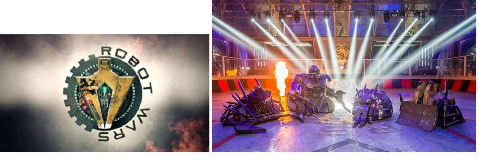

  

# guerre-robotiche-ai-kata
Progetto per studio uso agent ai in un coding dojo

## Coding Dojo
- No test, no codice
- Rallentiamo
- Collaborazione, non competizione

**Regole:**
https://codingdojo.org/practices/WhatIsCodingDojo/

Al Dojo non si può discutere senza codice e non si può scrivere codice senza test. È un luogo di formazione alla progettazione, dove si riconosce che "il codice è il progetto" e che il codice senza test semplicemente non esiste.

### Rallenta
Imparare qualcosa dovrebbe costringervi a rallentare. 
Si può andare più veloci perché avete imparato alcuni trucchi, 
ma non potete andare più veloci e imparare allo stesso tempo. 

### Collaborazione, non competizione
Favoriamo il confronto e il divertimento nello sperimentare e 
imparare assieme modi diversi di lavorare. 
Vi consigliamo caldamente di lavorare almeno a coppie e cercate di alternarvi alla tastiera. 
Questo vi obbliga anche a fare piccoli passi.

---

## Guerre robotiche: il gioco
Guerra tra robot nello spazio di una griglia

  

### Modalità
- Sviluppo a iterazioni:
- 10 minuti circa di confronto alla fine di ogni iterazione
- Dopo ogni iterazione i gruppi ruotano un loro membro

### Definition of Done
Per considerare una iterazione completata è necessario che il software soddisfi questi requisiti:
- I test automatici testano le funzionalità dell’iterazione e possono essere eseguiti con successo
- Il software è funzionante ed è possibile eseguirlo e provarlo

#### Iterazione 1 - Definizione arena
- L’area di combattimento è formato da una griglia quadrata di dimensioni arbitrarie (4x4, 10x10, 132x132).
- Ogni robot è posizionato nell’arena (x,y), è rivolto verso un punto cardinale (N,S,W,E) e può essere vivo o morto.
- Visualizzare l’arena e i robottini come preferite (CLI, HTML, canvas, altro?)

Momento di riflessione e confronto (10 minuti)

#### Iterazione 2 - Movimenti
Ogni robottino può eseguire una delle seguenti azioni alla volta:
- Rotazione di 90 gradi (L - Left, R - Right)
- Spostamento di una posizione (F - Forward, B - Backward) orientato verso il punto cardinale a cui è rivolto il robot
- Un robottino non può spostarsi in una posizione già occupata da un altro robottino

Momento di riflessione e confronto (10 minuti)

#### Iterazione 3 - Attacco
- Lo sparo è una nuova azione che può effettuare il robottino
- Lo sparo (X) va nella direzione in cui il robot è rivolto
- Se il robot spara non può muoversi o ruotare allo stesso tempo
- Lo sparo ha una gittata che equivale alla parte intera del 25% della dimensione della griglia maggiore di 0
- Se più robot sono sulla linea di tiro e dentro la gittata dello sparo solo quello più vicino viene colpito
- Se un robot viene colpito da uno sparo muore

Momento di riflessione e confronto (10 minuti)

#### Iterazione 4 - Turni
- Il turno di gioco è gestito dall’applicazione, non può essere scelto dal giocatore
- Ad ogni turno il robottino può eseguire una sola azione tra rotazione, movimento o sparo. Dopo il quale si passa al turno successivo
- Se rimane solo un robot in gioco, la partita si conclude con la sua vittoria.

Momento di riflessione e confronto (10 minuti)

#### Iterazione 5 - Effetti
- Il robot morto diventa un ostacolo: 
  - un robot non può occupare la stessa posizione di un robot morto
  - Un robot morto che è sulla linea di tiro di uno sparo protegge gli altri robot che sono dietro
- Se un robot oltrepassa i confini dell’arena si ritrova nel lato opposto al quale è uscito
- Se uno sparo oltrepassa i confini dell’area prosegue dal lato opposto

Momento di riflessione e confronto (10 minuti)

#### Iterazione 6 - Livelli
- Il livello iniziale è 1
- Ad ogni uccisione compiuta l’attaccante sale di un livello.
- Ad ogni livello guadagnato aumenta il numero di spari che è necessario subire prima di essere sconfitti.
(es: Livello 1 => 1 colpo e sei morto, livello 2 => servono 2 colpi per ucciderti e così via)
- Se si sale di livello, la vita aumenta, ma il danno rimane se si è già stati colpiti

Momento di riflessione e confronto (10 minuti)
